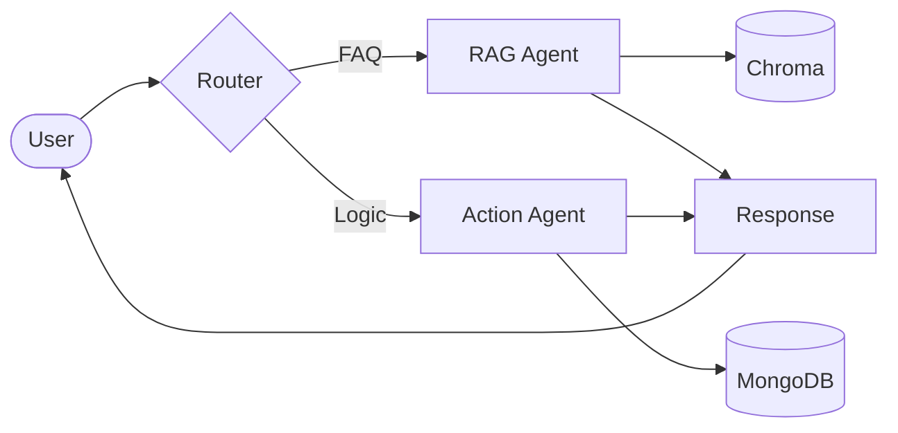

# Agentic-CX — AI-Powered Customer Support Platform

Agentic-CX is a production-grade, multi-agent AI system designed to automate customer support while maintaining human-level precision. It leverages an autonomous orchestration layer to route intents, perform RAG-based knowledge retrieval, and execute real-world business actions.

---

## 🚀 Key Features

- **Multi-Agent Orchestration**: Intelligent routing between RAG (Retrieval-Augmented Generation) and Action agents.
- **WhatsApp Integration**: Real-world chatbot deployment via Twilio.
- **Observability Dashboard**: Comprehensive admin panel with real-time analytics and charts.
- **Automated Evaluation**: Integrated Ragas pipeline to measure Faithfulness, Relevancy, and Context Precision.
- **Escalation Logic**: Adaptive sentiment detection that triggers human intervention (ticketing) for angry or frustrated users.
- **Cloud-Native Vector Search**: High-performance semantic retrieval using Chroma Cloud.

---

## 🧠 Architecture

Agentic-CX uses a "Router-Worker" architecture to ensure modularity and scalability.



The system is designed with a **fail-safe layer**: if the AI detects high friction or fails an action, it automatically escalates to the **Ticketing System**, preserving user trust.

---


---

## 🧪 Evaluation & Quality

Quality is built-in, not added on. We use the **Ragas** framework to evaluate our LLM responses against three core metrics:

- **Faithfulness**: Ensures the AI doesn't hallucinate outside the provided context.
- **Answer Relevancy**: Measures how directly the AI addresses the user's specific problem.
- **Context Precision**: Evaluates the signal-to-noise ratio of our vector retrieval.

These metrics are tracked and displayed in the Admin Dashboard, enabling data-driven optimization of the system prompts and chunking strategies.

---

## 🛠️ Tech Stack

- **Backend**: Node.js, Express, LangChain
- **Frontend**: React, Tailwind CSS, Recharts
- **Database**: MongoDB, Mongoose
- **AI**: OpenAI (GPT-4o), Ragas, Chroma Cloud
- **Communication**: Twilio API (WhatsApp)

---

## ⚙️ Quick Start

```bash
# 1. Install dependencies
npm install

# 2. Setup your .env with OpenAI and MongoDB keys
cp .env.example .env

# 3. Start the system
npm run dev
```

---

---

## 💡 Engineering Highlights

- **Designed for Zero-Downtime**: Built-in fallback heuristics for the Router Agent to ensure the system remains responsive even if LLM calls fail.
- **Built for Observability**: Implemented a central interaction logger that captures response time, intent, and retrieved context for downstream analysis.
- **Real-World Impact**: Focused on closing the gap between "AI Demo" and "Production Tool" through robust error handling and escalation workflows.

---

