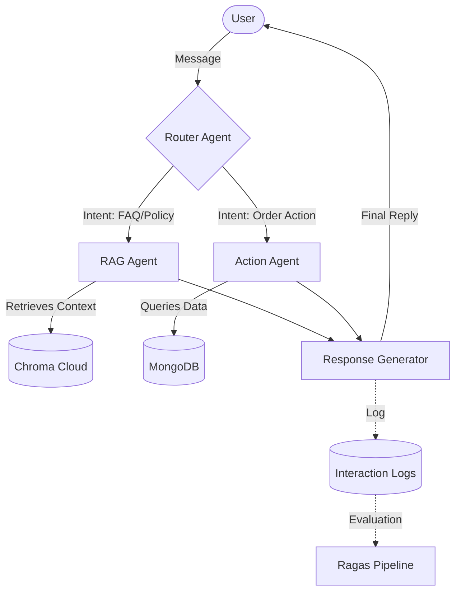

# System Architecture

Agentic-CX is built on a multi-agent orchestration pattern, designed to handle diverse customer intents through specialized AI agents. This document outlines the technical flow and component responsibilities.

## High-Level Flow

## Agent Components

### 1. Router Agent
The entry point for all user messages. It uses LLM-based intent classification to route requests to either the RAG Agent or the Action Agent. It also extracts entities (like Order IDs) and detects user sentiment (Neutral, Frustrated, Angry).

### 2. RAG Agent (Retrieval-Augmented Generation)
Handles knowledge-based queries. It performs a hybrid search (semantic + keyword) against **Chroma Cloud** to retrieve relevant documentation chunks and generates a factual response based strictly on that context.

### 3. Action Agent
Responsible for executing state-changing operations or retrieving dynamic data. Currently manages order status lookups via Mongoose/MongoDB. It is designed to be extensible for refunds, cancellations, and account management.

## Support Systems

### Ticketing & Escalation
When the Router Agent detects "Angry" sentiment or an Action Agent fails to resolve a critical request, the system automatically creates a support ticket in MongoDB. This ensures human intervention for high-friction cases.

### Evaluation Pipeline (Ragas)
A dedicated Python-based pipeline that quantifies the quality of the RAG system. It measures:
- **Faithfulness**: Does the answer stay true to the retrieved context?
- **Answer Relevancy**: How well does the answer address the question?
- **Context Precision**: Efficiency of the retrieval process.

### Admin Dashboard
A real-time observability platform built with React and Recharts. It provides stakeholders with analytics on query distribution, escalation rates, and Ragas quality metrics.
